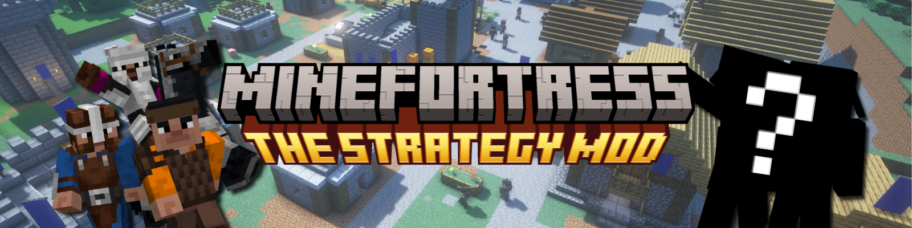
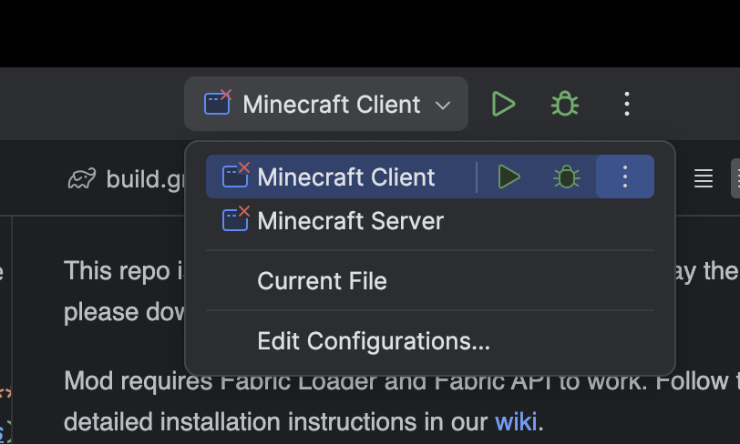
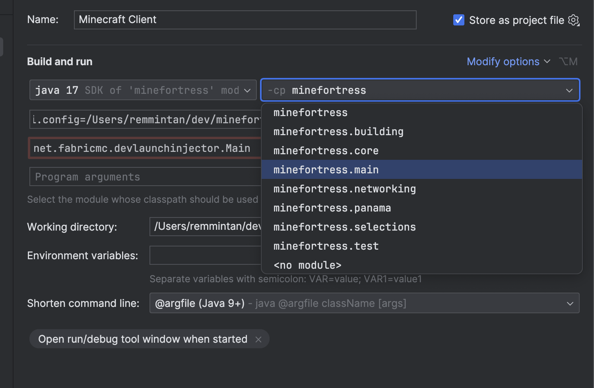

# MineFortress

The mod that turns your Minecraft into RTS. Take the role of a village leader, gather resources, build houses, hire professionals to grow and expand your village and even conquer your neighbors! Forget about the first-person view and control everything with your mouse pointer like in classic RTS games.
## Links
* **[Website](https://minecraftfortress.org/)**
* **[Patreon](https://www.patreon.com/minefortress)**
* **[Modrinth](https://modrinth.com/mod/minefortress)**
* **[CurseForge](https://www.curseforge.com/minecraft/mc-mods/minefortress-rts)**
## For Players
This repo is intendent for developers. If you want to play the mod, please download it from [CurseForge](https://www.curseforge.com/minecraft/mc-mods/minefortress-rts) or [Modrinth](https://modrinth.com/mod/minefortress).

Mod requires Fabric Loader and Fabric API to work.
Follow the detailed installation instructions in our [wiki](https://wiki.minecraftfortress.org/wiki/Installation:Curseforge_Launcher).

## For Developers
### Prerequisites
I assume that everyone who wants to contribute to the project is familiar with Java/Kotlin development in general.
I won't go in details of installing basic developer setup, but I will list all the tools that are required to work with the project:
* Java 17 - I prefer using [Adoptium](https://adoptium.net/) builds 
* IntelliJ IDEA - For the most convenient development experience and to get the results matching my results, I recommend using IntelliJ IDEA. You can download it [here](https://www.jetbrains.com/idea/download/).
* Git - To clone the repository and to commit your changes. You can download it [here](https://git-scm.com/downloads).

If you need some support in setting up your developer environment, please read articles located here: [Java development with IntelliJ IDEA](https://www.jetbrains.com/help/idea/getting-started.html)

Feel free to ask for help in our [Discord server](https://discord.gg/6rt7VJxPcq).
### Getting started / Installation
1. Clone the repository using Git.
2. Make sure that the project is cloned in the directory named `minefortress`. This is required to make Gradle work properly with IDEA.
3. Open the project in IntelliJ IDEA.
4. Wait for Gradle to finish importing the project.
5. We still need to make Run Configurations work. Fabric plugin will do it automatically, but we need to close the project.
6. Close the project and open it again.
7. New Run Configurations should appear. If they don't, try to restart IDEA.
8. Run Configuration may have small cross near it. It means that Fabric plugin used wrong module when setting up the configuration.

9. To fix it, edit the configuration and select `minefortress.main` module classpath dropdown.

10. Now you can run the project using the `Minecraft Client` configuration.

### Contributing
Any help is highly appreciated! If you want to contribute to the project, please follow these steps:
1. Fork the repository.
2. Create a new branch from `master` branch.
3. Make your changes.
4. Commit your changes and push them to your fork.
5. Create a pull request to `master` branch of this repository.

There is no contribution guide yet, but you can check out the [issues](https://github.com/remmintan/minefortress/issues) to find something to work on.
I will try to collect bugs and feature requests in the issues, but if you have any questions, feel free to ask them in our [Discord server](https://discord.gg/6rt7VJxPcq).

Also feel free to create issues if you find any bugs or have any feature requests.

Over time, I will try to create a contribution guide and a list of issues that are good for beginners.

## License
This project is licensed under the MIT License - see the [LICENSE](LICENSE) file for details.

## Donate
Support the open-source development by donating to the project. You can donate using the following methods:
* **[Patreon](https://www.patreon.com/minefortress)**
